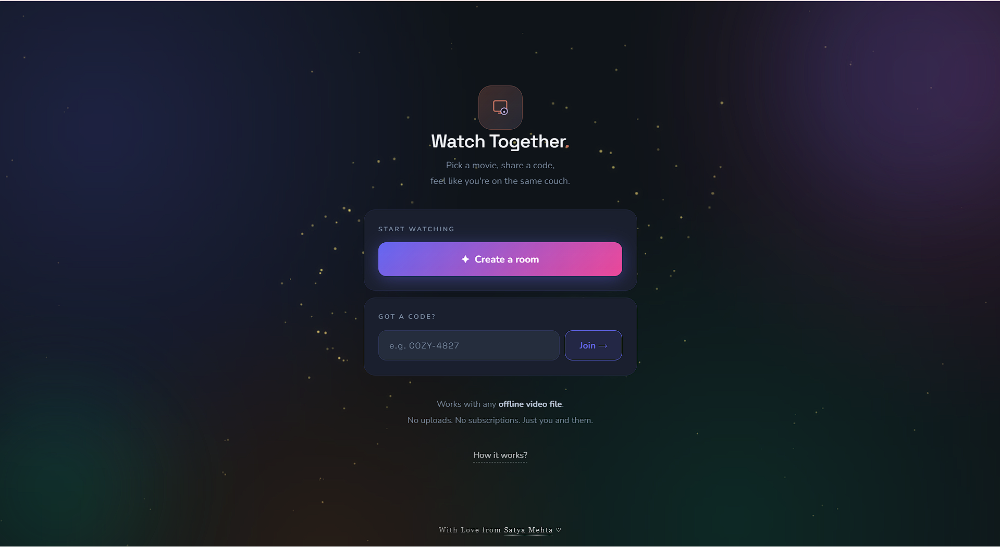
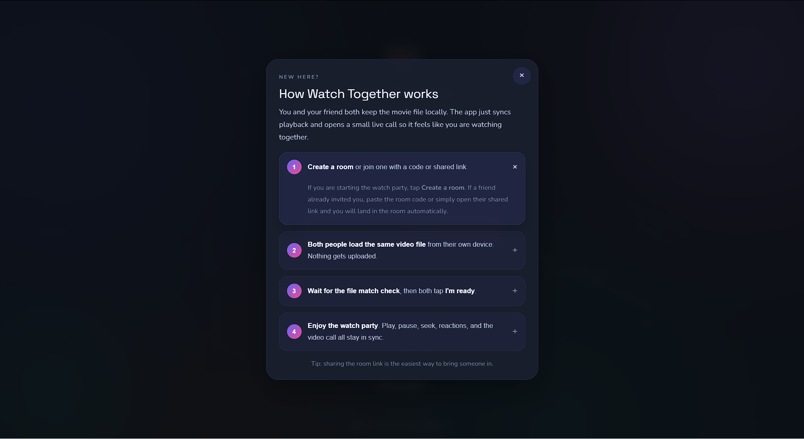
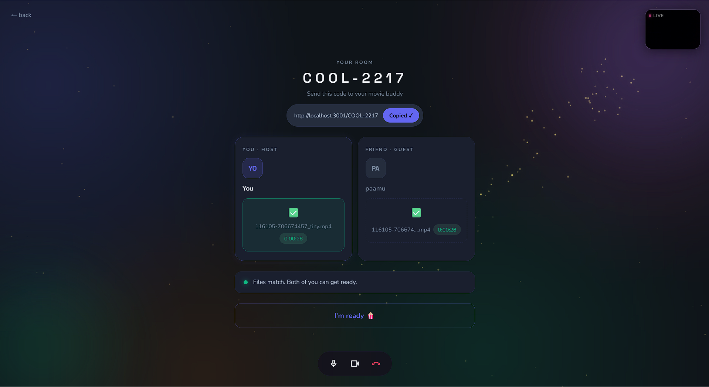
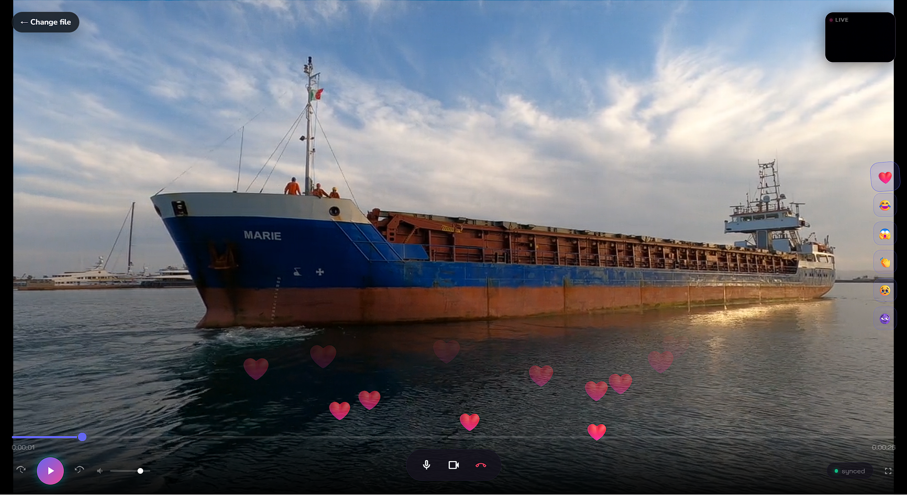

# Watch Together

Real-time watch party app for syncing local video playback between two people, with lobby readiness, reactions, shareable room links, and a peer-to-peer WebRTC video call.

The project is split into a static frontend and a separate Node/WebSocket backend so you can deploy the UI to Vercel and the server to Render.

## Screenshots

| | |
|---|---|
|  |  |
| Dashboard | New User Guide |
|  |  |
| Lobby | Player |

## Quick start

Backend:

```bash
cd backend
npm install
npm run dev
# or
npm start
```

Frontend:

- Open `frontend/index.html` locally with a static server, or deploy `frontend/` to Vercel.
- Point `frontend/config.js` at your deployed backend URL when frontend and backend are on different domains.

- Backend URL: `http://localhost:3001`
- WebSocket endpoint: `ws://localhost:3001/ws`
- Health check: `http://localhost:3001/health`

## Prerequisites

- **Node.js**: 14.0.0 or higher
- **npm**: 6.0.0 or higher
- **Modern browser**: Chrome, Firefox, Safari, or Edge (WebRTC support required)
- For WebRTC video call: microphone and camera access (browser will prompt)

## Configuration

### Frontend

Edit `frontend/config.js` to point to your deployed backend:

**Local development:**
```js
window.WATCH_TOGETHER_CONFIG = {
  backendBaseUrl: 'http://localhost:3001',
};
```

**Production (Render):**
```js
window.WATCH_TOGETHER_CONFIG = {
  backendBaseUrl: 'https://your-render-app-name.onrender.com',
};
```

The frontend will automatically convert the HTTP URL to WebSocket (`ws://` or `wss://`).

## Deployment

### Live App

The app is deployed and running live:
- **Frontend**: https://watchtogetherlive.netlify.com
- **Backend**: Deployed on Render (configured in frontend/config.js)

### Local Development

For local testing with both frontend and backend on the same machine:

```bash
# Terminal 1 - Backend
cd backend
npm install
npm run dev

# Terminal 2 - Frontend (if using a static server)
cd frontend
npx http-server -p 3000
# or use your favorite static server
```

Then open `http://localhost:3000` in your browser and point the config to `http://localhost:3001`.

## How it works

1. Create a room and share the generated room code or room link.
2. Both people join the same room.
3. Each person picks the same local video file.
4. The server compares file durations to catch mismatches.
5. Once both people mark ready, the app starts a countdown.
6. Play, pause, seek, react, and video chat in sync.

## Architecture

```text
Browser A (Vercel)        Render backend              Browser B (Vercel)
     |                        |                             |
     |── POST /api/rooms ────►|                             |
     |◄── { roomCode } ───────|                             |
     |                        |                             |
     |── open /ROOM-CODE ────►|                             |
     |                        |◄──── open /ROOM-CODE ──────|
     |                        |                             |
     |── WS join ────────────►|                             |
     |◄── joined snapshot ────|                             |
     |                        |◄──── WS join ──────────────|
     |◄── peer_joined ────────|                             |
     |                        |──── joined snapshot ──────►|
     |                        |                             |
     |── file_ready ─────────►|                             |
     |                        |─── peer_file_ready ───────►|
     |◄══ duration_check ═════|════ duration_check ═══════►|
     |                        |                             |
     |── ready_toggle ───────►|─── peer_ready ────────────►|
     |◄══ countdown_start ════|════ countdown_start ══════►|
     |                        |                             |
     |── play_pause / seek ──►|─── relay to peer ─────────►|
     |                        |                             |
     |── sync_check ─────────►|                             |
     |◄── sync_nudge ─────────|                             |
     |                        |                             |
     |── reaction ───────────►|─── reaction ──────────────►|
     |── webrtc_signal ──────►|─── webrtc_signal ─────────►|
```

## Project structure

```text
.
├── frontend/
│   ├── config.js       # frontend -> backend URL config
│   ├── index.html      # frontend UI
│   ├── vercel.json     # room-link rewrite to index.html
│   ├── assets/
│   └── src/
│       ├── app.js      # browser app logic
│       ├── client.js   # websocket client SDK
│       └── webrtc.js   # peer-to-peer video call module
└── backend/
    ├── app.js          # express app and REST routes
    ├── index.js        # http + websocket server entrypoint
    ├── roomManager.js  # in-memory room state
    ├── wsHandler.js    # websocket protocol handling
    └── package.json
```

## REST API

| Method | Endpoint | Description | Response |
|--------|----------|-------------|----------|
| `POST` | `/api/rooms` | Create a new room | `{ roomCode, roomId }` |
| `GET` | `/api/rooms/:code` | Validate a room before joining | `200 { roomId, peerCount }`, `404 { error }`, or `403 { error }` when full |
| `GET` | `/health` | Server health and live counts | `{ status, rooms, peers }` |

## WebSocket message protocol

### Client → Server

| Type | Payload fields | Description |
|------|----------------|-------------|
| `join` | `roomCode, name, isHost` | Join an existing room |
| `file_ready` | `durationSec, fileName` | Report the selected local file |
| `ready_toggle` | `isReady` | Toggle ready state in the lobby |
| `play_pause` | `playing, positionSec, timestamp` | Send play/pause command |
| `seek` | `positionSec` | Send seek command |
| `sync_check` | `positionSec` | Ask the server to compare drift |
| `reaction` | `emoji` | Send an emoji reaction |
| `webrtc_signal` | `signal` | Relay SDP/ICE data for WebRTC |
| `return_to_lobby` | none | Return both users to the file-pick lobby |

### Server → Client

| Type | Payload fields | Description |
|------|----------------|-------------|
| `joined` | `roomCode, peers, playState, masterId, yourPeerId` | Room snapshot after joining |
| `peer_joined` | `peerId, name, isHost` | Another user joined |
| `peer_left` | `peerId, name` | Another user disconnected |
| `peer_file_ready` | `peerId, durationSec, fileName` | Peer selected a file |
| `duration_check` | `match, diff, durations` | Duration comparison result |
| `peer_ready` | `peerId, isReady` | Peer toggled readiness |
| `countdown_start` | `positionSec` | Countdown before watch screen |
| `play_pause` | `playing, positionSec, masterId, serverTs` | Relayed playback command |
| `seek` | `positionSec, masterId, serverTs` | Relayed seek command |
| `sync_nudge` | `positionSec, drift, playing` | Server-detected drift correction |
| `reaction` | `emoji, fromPeerId` | Relayed emoji reaction |
| `webrtc_signal` | `signal, fromPeerId` | Relayed WebRTC signal |
| `return_to_lobby` | `peerId, name` | Peer changed file / returned to lobby |
| `error` | `message` | Server-side error |

## Frontend integration

```js
import { WatchTogetherClient } from './src/client.js';

const client = new WatchTogetherClient(
  `${(window.WATCH_TOGETHER_CONFIG?.wsBaseUrl || location.origin).replace(/^http:/, 'ws:').replace(/^https:/, 'wss:')}/ws`
);

await client.connect();
client.join({ roomCode: 'COOL-1234', name: 'You', isHost: true });

video.addEventListener('loadedmetadata', () => {
  client.fileReady(video.duration, file.name);
});

client.setPositionGetter(() => video.currentTime);

client.on('play_pause', async ({ playing, positionSec, serverTs }) => {
  const latencySec = (Date.now() - serverTs) / 1000;
  video.currentTime = positionSec + (playing ? latencySec : 0);
  if (playing) await video.play().catch(() => {});
  else video.pause();
});

client.on('seek', ({ positionSec }) => {
  video.currentTime = positionSec;
});

client.on('apply_sync', async ({ positionSec, playing }) => {
  video.currentTime = positionSec;
  if (playing) await video.play().catch(() => {});
  else video.pause();
});

client.on('reaction', ({ emoji }) => {
  showFloatingReaction(emoji);
});
```

## WebRTC video call

`frontend/src/webrtc.js` provides a peer-to-peer call layer on top of the same WebSocket connection. The server only relays signaling messages; audio and video flow directly between browsers after negotiation succeeds.

### Usage

```js
import { VideoCall } from './src/webrtc.js';

const call = new VideoCall(client, localVideoEl, remoteVideoEl);

await call.start(isHost);

call.on('connected', () => {
  console.log('P2P call live');
});

call.on('remote_stream', ({ stream }) => {
  console.log('Remote stream ready', stream);
});

call.toggleMute();
call.toggleCamera();
call.end();
```

### Events

| Event | Detail |
|-------|--------|
| `started` | `{ hasVideo, hasAudio }` |
| `connected` | none |
| `remote_stream` | `{ stream }` |
| `peer_disconnected` | none |
| `mute_changed` | `{ muted }` |
| `camera_changed` | `{ hidden }` |
| `camera_unavailable` | none |
| `media_unavailable` | none |
| `ice_state` | `{ state }` |
| `ended` | none |

### STUN / TURN

The module now tries public STUN servers first and also includes Open Relay STUN/TURN entries for tougher NATs and stricter networks. For a more controlled production deployment, you may still want to replace those with your own TURN service in `frontend/src/webrtc.js`.

## Sync behavior

- Either user can control playback.
- The server keeps an authoritative `playState` and extrapolates current position while playing.
- Drift larger than 2 seconds triggers a `sync_nudge`.
- Duration matching is used as a lightweight check that both users picked the same file.
- If one user leaves, playback is paused for the remaining user.
- Returning to the lobby resets readiness and playback state.

## Troubleshooting

### WebSocket connection fails

**Symptoms:** "Connection refused" or "Failed to connect" errors in the browser console.

**Solutions:**
- Verify the backend is running: Check `http://localhost:3001/health` (or your deployed URL).
- Check `frontend/config.js` points to the correct backend URL.
- Ensure `CORS_ORIGIN` in backend environment includes your frontend URL.
- Verify firewall/network allows WebSocket connections on the backend port.

### Video call doesn't start

**Symptoms:** P2P video not appearing or camera unavailable error.

**Solutions:**
- Grant browser permission for camera and microphone when prompted.
- Ensure both browsers support WebRTC (check console for errors like `getUserMedia failed`).
- Check NAT/firewall rules; some corporate networks block WebRTC. Try enabling TURN in `frontend/src/webrtc.js` or deploy your own TURN server.
- Verify `webrtc.js` module is loaded: Check browser DevTools Network tab.

### Video playback out of sync

**Symptoms:** Videos drift apart or show "Sync nudge" messages frequently.

**Solutions:**
- Network latency may be high; this is normal over slow connections.
- Ensure both files are identical (same resolution, codec, duration).
- Check the `duration_check` message in the WebSocket protocol; if durations don't match, users picked different files.
- Disable other bandwidth-heavy tasks on your network.

### Room persists after refresh

**Note:** This is expected behavior. Rooms are stored in memory and persist even after all users leave. If a user opens a room link later, they will see the old room state. To reset, restart the backend.

### Localhost connection shows "ws://localhost:3001" but still fails

**Solution:** Ensure the backend is running on the same machine. Port 3001 must be available and not blocked by another service. Use `netstat -ano | findstr :3001` (Windows) or `lsof -i :3001` (Mac/Linux) to check.

### Deployed frontend can't reach deployed backend

**Symptoms:** CORS errors or connection timeouts in production.

**Solutions:**
- Verify `frontend/config.js` uses the correct backend URL (must be the full Render URL, not localhost).
- Check backend `CORS_ORIGIN` environment variable includes the frontend domain.
- Verify both Render and Vercel deployments are active and running.
- Enable Render Pro to prevent backend from spinning down.

## Notes

- Rooms are stored in memory only.
- Each room supports up to 2 peers.
- Room links such as `/COOL-1234` open the same frontend and auto-join flow.
- For split deploys, set `frontend/config.js` to your Render backend URL.
